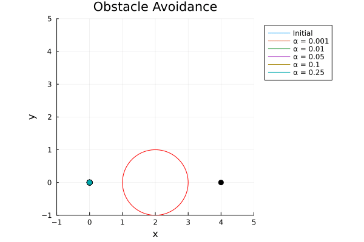

# Log Barriers in Multiplayer Collision-Avoidance Systems

Multiplayer collision-avoidance trajectory generation using log-barriers constraints and learning based on user-generated trajectories.

This repository consists of an optimal solver for obstacle avoidance and multiplayer collision-avoidance.

## Components

- GuessDI.jl:  an initial state vector using user-provided mouse clicks off of Julia Makie.
- DI.jl: Optimal trajectory solver for various alpha values using fed-in initial state vector.
- Plotting.jl: Generates a gif consisting of user-fed trajectories followed by optimal trajectory.

## How it works

This game-theory simulation for collision avoidance is fed a user-provided initial trajectory into the solver, where the solver avoid robot collisions with a log-barrier penalty. This is crucial as a sufficient initial trajectory can greatly reduce the search space needed to find the optimal solution.

You can read  for a walkthrough of the algorithm.
